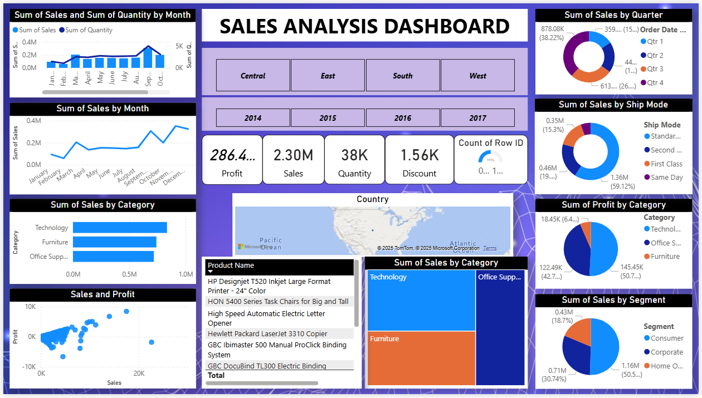

# Sales Analysis Dashboard (Power BI)

## 📊 Project Overview
This project analyzes sales performance using Power BI.
The dashboard provides insights into sales trends, regional performance,
and yearly comparisons.

## 🛠 Tools Used
- Power BI
- Excel
- Sample Superstore Dataset

## 🔍 Key Insights
- Sales comparison across regions (East, West, South)
- Year-wise sales trends
- Regional contribution to total sales

## 📁 Files in this Repository
- sales_visual.pbix – Power BI dashboard file
- sample_superstore.xls - Orders.csv.xlsx – Dataset
- preview.jpg – Dashboard preview
- Regional images for analysis

## 🖼 Dashboard Preview

